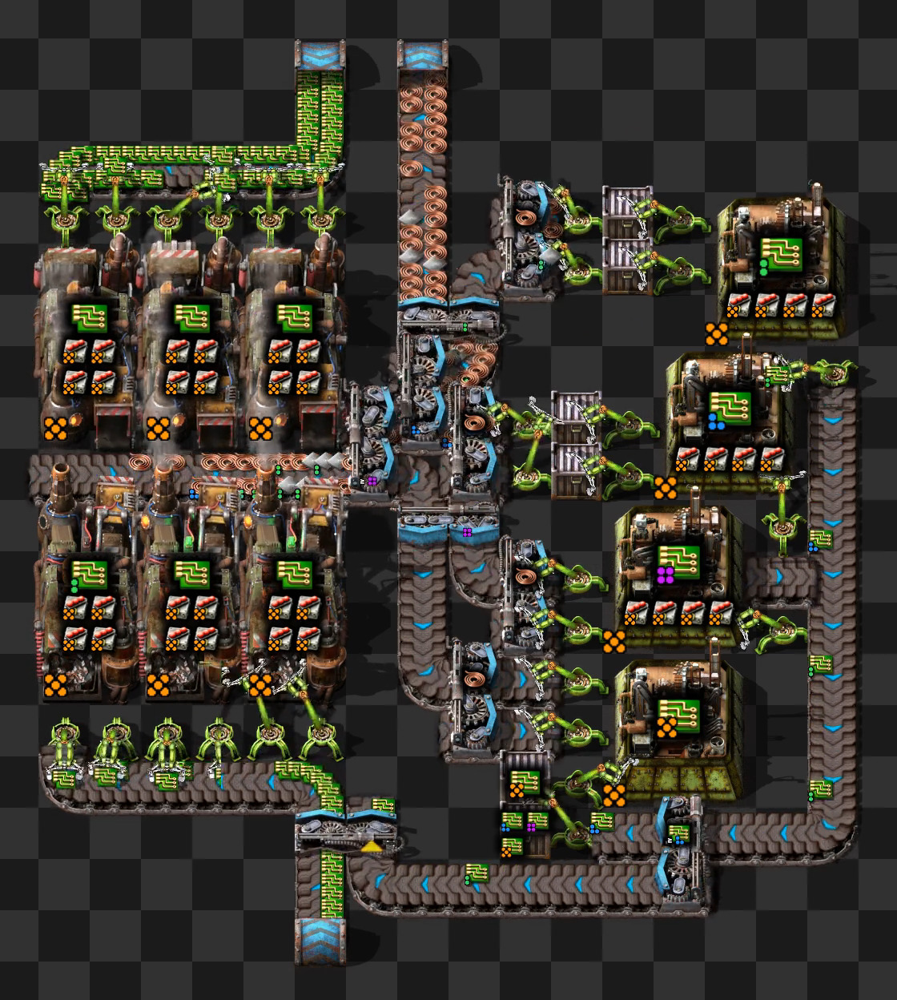

# Factorio Quality Optimizer

## Background

The latest expansion to Factorio introduced [Quality](https://factorio.com/blog/post/fff-375), a new mechanic in which quality modules can be used to increase the quality of every item in the game.
However, producing higher tiers of quality is exponentially difficult, as the probability of increasing quality by even one tier is quite small, let alone trying to make Legendary.
One way to automate the crafting of higher-tier quality items is to recycle lower-quality items that are below the desired tier, as demonstrated in the original quality FFF that only retains rare and above:



However, optimal recycling loops are not as simple as shoving quality modules everywhere, and often require a mix of prod and quality modules.
The optimal mix depends significantly on factors such as the module tiers (1-3), the module qualities (1-5), the starting and ending qualities being crafted, and any additional prod bonuses.
Sometimes the optimal mix is skewed more towards quality modules and sometimes towards prod modules, and it's usually not obvious what the exact ratio will be ahead of time.

## The Script

This script optimizes the prod/qual modules at each quality stage in a recycling loop, and prints the number of low-quality inputs to high-quality outputs.
It also prints out any extra by-products, such as how many higher-quality items will be produced than the one being requested.
Note the recycler always has four recycling modules.
All of the allowed parameters are shown below, and are also shown with the command `python ./main.py --help`:

```
python ./main.py --help
usage: Factorio Quality Optimizer [-h] [-pt PRODUCTIVITY_TIER] [-qt QUALITY_TIER] [-q MODULE_QUALITY] [-sq STARTING_QUALITY] [-eq ENDING_QUALITY] [-mq MAX_QUALITY] [-r] [-nr] [-ms MODULE_SLOTS]
                                  [-p ADDITIONAL_PROD]

This program optimizes prod/qual ratios in factories, and calculates outputs for a given input

options:
  -h, --help            show this help message and exit
  -pt PRODUCTIVITY_TIER, --productivity-tier PRODUCTIVITY_TIER
                        Productivity module tier. Number from 1 to 3. Default=3
  -qt QUALITY_TIER, --quality-tier QUALITY_TIER
                        Quality module tier. Number from 1 to 3. Default=3
  -q MODULE_QUALITY, --module-quality MODULE_QUALITY
                        Quality of the modules in the assembler and recycler (if present). Number from 1 to 5. Default=5
  -sq STARTING_QUALITY, --starting-quality STARTING_QUALITY
                        Starting quality ingredient. Number from 1 to 4. Default=1
  -eq ENDING_QUALITY, --ending-quality ENDING_QUALITY
                        Ending quality to optimize. Number from 2 to 5. Must be greater than starting quality. Default=5
  -mq MAX_QUALITY, --max-quality MAX_QUALITY
                        Max quality unlocked. Number from 3 to 5. Must be greater than or equal to ending quality. Default=5
  -r, --enable-recycling
                        Enables recycling loops. Set this flag if you have unlocked the recycler. This flag is set by default.
  -nr, --no-enable-recycling
                        Disables recycling loops. Set this flag if you have not unlocked the recycler.
  -ms MODULE_SLOTS, --module-slots MODULE_SLOTS
                        number of module slots in the crafting building. Default=4
  -p ADDITIONAL_PROD, --additional-prod ADDITIONAL_PROD
                        any extra prod bonus, either from the building or recipe research. Units are percent out of 100. For example if using the foundry, enter 50. Default=0
```

The script is written in python and depends on the libraries in `requirements.txt`.
Detailed instructions on how to setup the required python environment is beyond the scope of this README, but if you're new to Python and want to run it, I would recommend the following steps:
1. search "how to install python {windows/mac/linux}" in google and get python available in the terminal or powershell.
2. use `git clone` to get a copy of this repository
3. use `virtualenv` to setup a virtual environment
4. run `pip install -r requirements.txt`
5. run `python ./main.py {--args}` to run the script

## Examples

### Example 1

Suppose you're really late-game and have access to legendary tier 3 modules, while using an assembler with four modules slots, and want a recycling loop that turns normal ingredients into legendary products (note this is script with all defaults):

```
python ./main.py 

optimizing recycling loop that turns ingredient quality 1 into product quality 5

q1 input per q5 output: 79.87855759632312
recipe q1 uses 2 quality modules and 2 prod modules
recipe q2 uses 2 quality modules and 2 prod modules
recipe q3 uses 2 quality modules and 2 prod modules
recipe q4 uses 0 quality modules and 4 prod modules
```

### Example 2

Suppose instead you're mid-game and all have tier 3 modules, but they are only level 2 quality (uncommon). Also suppose you haven't unlocked epic yet, and want to a recycling loop that turns normal ingredients into uncommon products, and you're using the electromagnetics plant with 5 modules slots and built-in productivity of 50%:

```
python ./main.py --productivity-tier 3 --quality-tier 3 --module-quality 2 --starting-quality 1 --ending-quality 2 --max-quality 3 --module-slots 5 --additional-prod 50

optimizing recycling loop that turns ingredient quality 1 into product quality 2

q1 input per q2 output: 2.466913725362153
recipe q1 uses 0 quality modules and 5 prod modules

as an additional bonus you get the following for each q2 output:
q3 ingredient: 0.013713390145949652
q3 output: 0.08162732229731934
```

If we're optimizing for uncommon, we don't want any quality modules in the electromagnetics plant!

Now let's try the same as above but optimizing for rare outputs:
```
 python ./main.py --productivity-tier 3 --quality-tier 3 --module-quality 2 --starting-quality 1 --ending-quality 3 --max-quality 3 --module-slots 5 --additional-prod 50

optimizing recycling loop that turns ingredient quality 1 into product quality 3

q1 input per q3 output: 8.524892733141074
recipe q1 uses 5 quality modules and 0 prod modules
recipe q2 uses 0 quality modules and 5 prod modules
```

In this case we use different types of modules for each quality level!
Going from normal to uncommon wants every module to be quality, while going from uncommon to rare wants every module to be productivity.

### Example 3

Suppose we're late-game (all modules are tier 3 legendary), and we want to turn an item into itself. Is it better to go up the production chain and down (craft then recycle), or down the production chain and back up (recycle then craft)? We'll just use normal assemblers (four module slots, no additional prod). This is where the `--starting-type` and `--ending-type` come in handy.

Going up-then-down the production chain gives around 160 inputs/output:

```
python ./main.py --starting-type ingredient --ending-type ingredient

optimizing recycling loop that turns ingredient quality 1 into ingredient quality 5

q1 input per q5 output: 159.75711519264624
recipe q1 uses 2 quality modules and 2 prod modules
recipe q2 uses 2 quality modules and 2 prod modules
recipe q3 uses 2 quality modules and 2 prod modules
recipe q4 uses 0 quality modules and 4 prod modules
```

Going down-then-up the production chain gives around 172 inputs/output:

```
python ./main.py --starting-type product --ending-type product

optimizing recycling loop that turns product quality 1 into product quality 5

q1 input per q5 output: 171.5214553581744
recipe q1 uses 2 quality modules and 2 prod modules
recipe q2 uses 2 quality modules and 2 prod modules
recipe q3 uses 2 quality modules and 2 prod modules
recipe q4 uses 0 quality modules and 4 prod modules
```

So it's better to go up-then-down, which makes intuitive sense since we get extra prod on the way up, but the difference isn't that significant.
